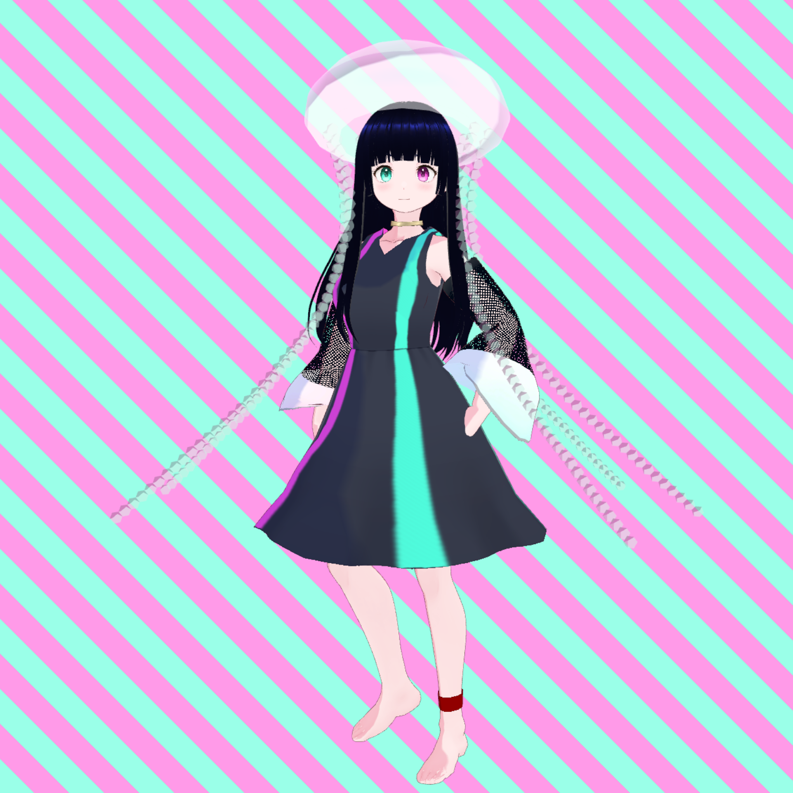

[English](/README.md) | 日本語

  <picture>
    
  </picture>

  <strong>
    <h1>ナタクラゲ</1>
  </strong>

[![Twitter][twitter_shields]][twitter_link]
[![YouTube][youtube_shields]][youtube_link]

[twitter_shields]: https://img.shields.io/twitter/follow/natakurage
[youtube_shields]: https://img.shields.io/youtube/channel/views/UCm7xuqpIRKqAoxd46wfWg3Q

[twitter_link]: https://twitter.com/natakurage
[youtube_link]: https://www.youtube.com/channel/UCm7xuqpIRKqAoxd46wfWg3Q

  <a href="https://natakurage.cc">
    <picture>
      
    </picture>
  </a>
  &nbsp;&nbsp;
  <a href="https://bsky.app/profile/natakurage.cc">
    <picture>
      
    </picture>
  </a>
  &nbsp;&nbsp;
  <a href="https://note.com/minamo_ntk">
    <picture>
      <source height="30px" media="(prefers-color-scheme: dark)" srcset="assets/images/note_white.svg" />
      
    </picture>
  </a>
  &nbsp;&nbsp;
  <a href="https://www.youtube.com/channel/UCm7xuqpIRKqAoxd46wfWg3Q">
    <picture>
      
    </picture>
  </a>
  &nbsp;&nbsp;
  <a href="https://twitter.com/v_natakurage">
    <picture>
      <source height="30px" media="(prefers-color-scheme: dark)" srcset="assets/images/x_white.svg" />
      
    </picture>
  </a>

 

コードを書く変態（あるいは、書かない変態）。主にWeb系、3D系、音楽系に興味がある。VTuber「千本槍みなも」のマネージャー。本人がやっているという噂もあるが信憑性は不明。

# 千本槍みなも

クラゲの力を融合させられた生命体。人類を絶滅させるチャンスを虎視眈々と狙っている。最近は未確認系VTuberとしても活動している。おやつに乾燥わかめをそのまま食べる。

> [!TIP]
> 発表でわざとツッコミどころのある資料を作ると質問をそこに誘導できるので、想定外の質問が来ずに済むよ！

# 💪Skills

## Most familiar

  

## Intermediate

  

## Beginner

  

## Using

  

# ❝Quotes❞

> The world is more absurd than you think.
> 
- Claude Émile Jean-Baptiste Litre

> Don't believe my "quotes" on the internet because they are all lies.
> 
- Albert Einstein
